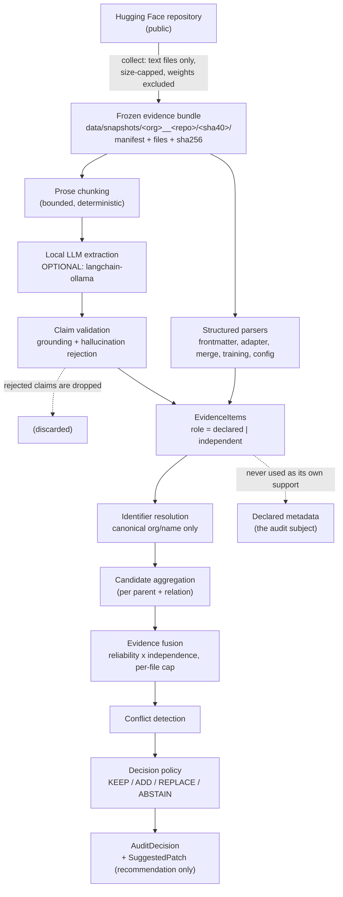

# Architecture

How a repository becomes a lineage decision, and which parts are deterministic.

The governing rule: **the deterministic core decides; an optional local LLM may
only ever add validated evidence.** No component of the decision path imports a
model runtime, and the LLM path fails closed — if it is unavailable or its output
does not validate, the system behaves exactly as if prose extraction had never
been attempted.

## Data flow



Two edges matter:

* `VAL -.-> DROP` — a hallucinated or ungrounded claim is *discarded*, never
  downgraded into weak evidence.
* `ITEMS -.-> DECL` — declared metadata (`base_model` in the model card) is the
  thing being audited. It is recorded as `role=declared`, and the fusion step
  refuses to count it as support for a change to itself.

## The layers, in order

### 1. Collection — `provenancelens.collectors`

Safety-first and network-only. Fetches provenance-relevant **text** files
(`README.md`, `config.json`, `adapter_config.json`, `tokenizer_config.json`,
`generation_config.json`, plus `merge*` / `train*` / `adapter*` / `quantiz*` /
`provenance*` matches). Weights and binaries are excluded **by name and type
before any download**; a hard byte cap is enforced again while streaming.
Per-file failures become structured statuses (`PARTIAL`, `NO_RELEVANT_FILES`,
`PRIVATE_OR_GATED`, …) instead of exceptions, so one broken file never discards
the rest. Two injectable seams (`api`, `fetcher`) make the whole state machine
unit-testable offline.

Collection never decides anything.

### 2. Frozen snapshots — `provenancelens.snapshots`

Identity is `repository + resolved commit sha`. Files are written read-only with
SHA-256 hashes; an identical re-collection is reused, a *differing* one raises a
conflict instead of overwriting immutable evidence. `load_snapshot` is fully
offline and verifies hashes, UTF-8 decodability and path safety before any
parsing. This is what makes the whole project reproducible without a network.

### 3. Deterministic parsing — `provenancelens.parsers`

| Source | Typical reliability | Relation it may assert |
| --- | --- | --- |
| `adapter_config.json` | `very_high` | `adapter` |
| merge config (`mergekit_config.yml`, …) | `high` | `merge` |
| training config | `medium_high` | none (a field names a model, it does not state a relationship) |
| `config.json` / `generation_config.json` | `medium` | none |
| README front matter | `not_applicable` (declared) | never used as its own support |
| README prose (deterministic rules) | `medium` | only from explicit phrases |

Invariants that the rest of the system depends on:

* **declared ≠ independent is categorical**, not a weighting choice;
* independent evidence **never inherits** the declared relation;
* local paths and checkpoints are rejected as public model ids, but the raw
  value is kept as evidence with a rejection note;
* a quantization relation is never inferred from file presence, filename or
  format similarity — only from an explicit statement;
* every claim keeps its exact file and key path;
* malformed input becomes a structured issue, never an exception.

### 4. Identifier resolution — `provenancelens.resolution`

Conservative by design: a bare model name without an organization does **not**
become a public model id, and the resolver never queries a hub. Unresolvable
identifiers are reported as issues and make the decision abstain rather than
guess.

### 5. Candidate aggregation and independence — `provenancelens.reasoning.candidates`

Evidence is grouped per (parent, relation) candidate. Independence is
**per source file**: the same claim repeated in ten files is not ten
independent confirmations. Fusion multiplies each item's reliability weight by
an independence factor and caps per-file contributions, so a single file cannot
manufacture support.

### 6. Conflict detection — `provenancelens.reasoning.conflicts`

Competing candidates, relation disagreements, an unverifiable declared relation
and multi-parent ambiguity each produce a structured conflict. Conflicts are
data: they are carried on the decision and shown in the report, never collapsed
silently.

### 7. Decision policy — `provenancelens.reasoning.decision`

`KEEP` / `ADD` / `REPLACE` / `ABSTAIN` from declared lineage, fused evidence and
conflicts. A repair requires sufficient support *and* a provable relation; when
either is missing the system abstains. The output is an `AuditDecision` with a
`SuggestedPatch` — a **recommendation only**. ProvenanceLens never writes to an
external repository.

`support_score` is a capped sum of documented per-artifact contributions. It is
a **heuristic evidence strength, not a probability**, and no metric treats it as
a calibrated confidence.

### 8. Prose extraction (optional) — `provenancelens.prose`, `provenancelens.llm_runtime`

Deterministic phrase rules run first and need nothing installed. The optional
local-LLM path (`langchain-ollama`, e.g. Ollama) additionally reads bounded
prose chunks under a pinned prompt (versioned and digested). Claims must pass
grounding validation — the quoted span must exist in the supplied text, the
parent must occur in that span, the relation must be one of the canonical four,
and a lineage statement must actually be present. Everything else is rejected
with a typed failure code. Prompt injection is handled as untrusted data, never
as instructions.

The chain is `PromptTemplate | ChatModel | text parser | structured parser`, and
every failure mode — malformed output, refused output, timeout, missing
dependency, unreachable runtime, model not installed — is a *reported outcome*,
not a crash.

### 9. Benchmark and study — `provenancelens.evaluation`

```
CONTROLLED (26, constructed)   REAL (44, adjudicated)
              \                  /
               \                /
            load_benchmark()  ->  self-validation  ->  run_system()
                                                        |
                       +--------------------------------+
                       |                                |
              metrics (Phase F)              Phase G study layer
                       |                                |
     action / parent / relation / coverage      ablations, failure taxonomy,
     repair safety, selective sweep,            evidence contribution, strata,
     calibration guardrails                    risk-coverage, Wilson intervals
                       \                                /
                        +---------------+----------------+
                                        |
                          results/phase_g/  (canonical, committed)
```

The evaluation package never imports the network stack: acquiring new
repositories is a separate explicit command, and the Hub client is imported
inside that closure. Ground truth never comes from the engine — labels are
constructed (CONTROLLED) or adjudicated from the frozen artifacts (REAL), and
validation rejects any label that contradicts what the repository declares.

The Phase G ablations are **evidence transformations run through the unmodified
engine**, so a metric delta is attributable to the ablated component and never
to a reimplementation.

## Where the boundaries are drawn

| Concern | Package | May import an LLM? | Network? |
| --- | --- | --- | --- |
| Collection | `collectors` | no | yes (the only component that does) |
| Frozen evidence | `snapshots` | no | no |
| Parsing | `parsers` | no | no |
| Resolution | `resolution` | no | no |
| Reasoning | `reasoning` | no | no |
| Prose extraction | `prose`, `llm_runtime` | yes, optional | no |
| Audit rendering | `reporting` | no | no |
| Evaluation & study | `evaluation` | comparator only, opt-in | no |

The test suite enforces these boundaries, including that the evaluation package
still imports with `httpx` and `huggingface_hub` absent.

## Reading the code in a sensible order

1. `src/provenancelens/schemas/lineage.py` — the vocabulary (relations, lineage)
2. `src/provenancelens/schemas/evidence.py` — the evidence vocabulary and the
   declared/independent split
3. `src/provenancelens/schemas/audit.py` — the decision and patch schemas
4. `src/provenancelens/reasoning/` — `candidates.py` → `fusion.py` →
   `conflicts.py` → `decision.py`
5. `src/provenancelens/parsers/` — how one becomes the other
6. `src/provenancelens/evaluation/` — how the decisions are scored
7. `src/provenancelens/demo.py` — a runnable summary of the above
